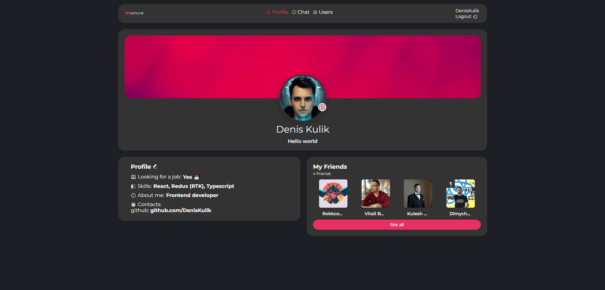

# Samurai Way

[Demo](https://deniskulik.github.io/samurai-way/)

## Built With
This is a social network project built using `React`, `Redux`, `TypeScript`, `React-router`, `REST API`, `Axios`, `WebSocket`, `Formik`, `Jest`, and `SCSS`. This social network platform allows users to connect with friends, edit their profiles, chat, and search for other users.

## Screenshots

## Description
The Social Network project is a dynamic platform for users to connect and interact with their friends and discover new connections. It provides essential social networking features such as profile management, friend connections, real-time chat, and user discovery.

